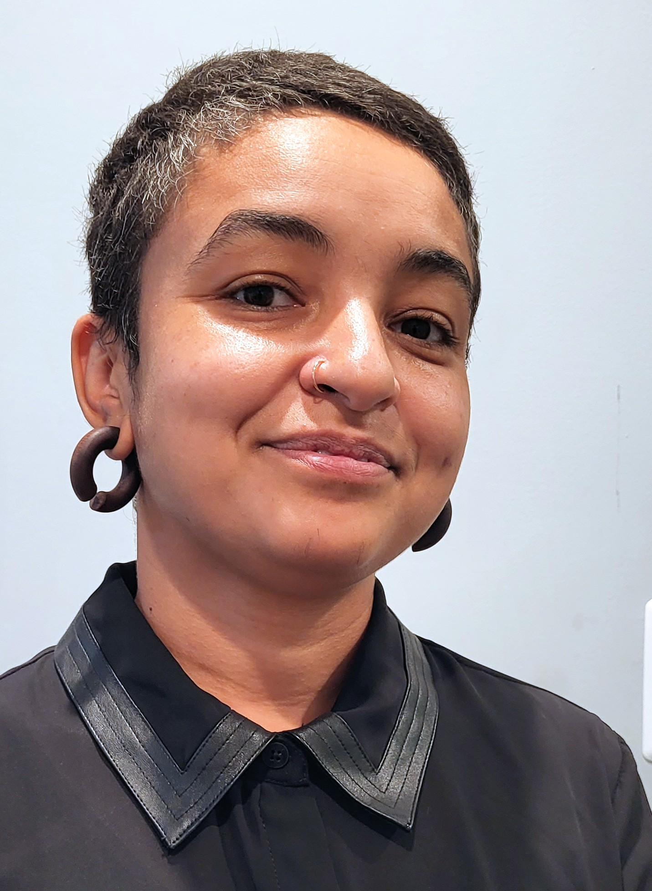

# Camille Seaberry

+----------------------------------------------------------+---------------------------------:+
| Baltimore, MD                                            | {width="181"} |
|                                                          |                                  |
| camille.seaberry\@gmail.com                              |                                  |
|                                                          |                                  |
| [github.com/camille-s](https://www.github.com/camille-s) |                                  |
+----------------------------------------------------------+----------------------------------+

## Education

**University of Maryland, Baltimore County**, M.P.S., Data Science (expected Dec 2023); Post-Baccalaureate Certificate in Applied Social Research Methods (expected Dec 2024)

**Harvard Extension School**, Graduate Certificate in Data Science (2017)

**Yale University**, B.S., Physics (2008)

## Relevant work experience

### DataHaven, New Haven, CT

*Senior Research Associate, Jul 2016--present*

Carried out in-depth research, analysis, and visualization of data across a wide variety of fields, including demographics, income and employment, and community health and well-being; co-authored several publications on various aspects of community well-being and health equity, with decision-making across all phases from planning through research and print, including statewide and regional reports and in local news outlets; built and maintained early dashboard of local COVID-19 data used by organizations and policymakers; led efforts to overhaul technologies used by staff, including development of several R packages; designed and developed dashboards and interactive data visualizations to bring data to broader, non-technical audiences; trained nonprofit and community organization staff throughout the state on data literacy skills; represented DataHaven at national conferences and participated in activities of the National Neighborhood Indicators Partnership; supported local organizations in data analysis and small survey projects.

### Farnam Associates, LLC, New Haven, CT

*Associate, Mar 2015--Apr 2016*

Researched and co-wrote federal grant applications awarded to the City of New Haven and local organizations; assisted in strategic planning and project implementation for several federal grants; provided support to the City Transformation Plan and application for federal Promise Zone designation, including data analysis, interactive data visualization, and web development; implemented technology for multi-partner case management initiatives; carried out research and writing projects, including report on Connecticut's juvenile justice system and analysis of juvenile justice data; developed grant applications, partnership proposals, and other support documents for local nonprofit organizations; built office's website

### Common Ground High School, New Haven, CT

*Coordinator of afterschool academic support; afterschool STEM program developer; teaching assistant / tutor, Sep 2010--Jun 2015*

Taught Geometry and Precalculus courses; designed and launched afterschool programs focused on exploring STEM fields; facilitated student projects in computer programming, open-source hardware, and multimedia technology; launched Saturday and summer tutoring and girls-only math support to better meet needs of students; supported Senior Seminar in using statistics and data visualization for social justice capstone projects; tutored students in all subjects; developed and coordinated individualized support plans for students as needed; served on organization-wide diversity committee

### ChildSight program, Helen Keller International, New Haven, CT

*Project Assistant, Nov 2008--Jun 2010*

Provided vision screening for classes of middle school students; served as point-person between students, school administrations, parents, and ChildSight program; collected and formatted data for school nurses and donor reports; helped maintain and organize small nonprofit office.

### Yale University, LaVan Lab Group, Mechanical Engineering, New Haven, CT

*Student Researcher, May--Aug 2006*

Developed, troubleshot, and integrated code in Matlab; designed and created graphical user interfaces to share code with multi-university research community.

## Technology & related skills

-   Extensive experience with R language for data analysis, visualization, publication, GIS, and package development
-   Extensive experience with Python for data analysis and data science
-   Experience with Javascript and other web development technologies for building data visualizations, dashboards, and other data-related applications
-   Coursework in data science, statistics, spatial analysis, applied mathematics, social science research methodologies, physics, environmental science, and writing

## Selected publications

-   Seaberry, C., Davila, K., & Abraham, M. (2023). [*Connecticut Town Equity Reports*](https://ctdatahaven.org/reports/connecticut-town-equity-reports).
-   Davila, K., Abraham, M., & Seaberry, C. (2023). [*Health Equity in Connecticut 2023*](https://ctdatahaven.org/reports/health-equity-connecticut-2023).
-   Abraham, M., Seaberry, C., Davila, K., & Carr, A. (2023). [*Fairfield County Community Wellbeing Index 2023*](https://ctdatahaven.org/reports/fairfield-county-community-wellbeing-index).
-   Abraham, M., Seaberry, C., Davila, K., & Carr, A. (2023). [*Greater Hartford Community Wellbeing Index 2023*](https://ctdatahaven.org/reports/greater-hartford-community-wellbeing-index).
-   Abraham, M., Seaberry, C., Davila, K., & Carr, A. (2023). [*Greater New Haven Community Wellbeing Index 2023*](https://ctdatahaven.org/reports/greater-new-haven-community-wellbeing-index).
-   Davila, K., & Seaberry, C. (2022). [*Rural Health in Connecticut*](https://ctdatahaven.org/reports/rural-health-connecticut-2022).
-   Davila, K., Abraham, M., & Seaberry, C. (2020). [*Towards Health Equity in Connecticut*](https://ctdatahaven.org/reports/towards-health-equity-connecticut).
-   Seaberry, C. (2018). [*Housing Segregation in Greater New Haven*](https://ctdatahaven.org/reports/ct-data-story-housing-segregation-greater-new-haven).
-   Seaberry, C., & Abraham, M. (2017). [*Merging 500 Cities and Connecticut Data on Health Equity*](https://ctdatahaven.org/reports/merging-500-cities-and-connecticut-data-health-equity)